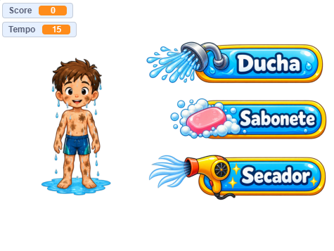

Esta pasta contém as imagens usadas no jogo **"Lava-Rápido de gente"**, feito em Scratch, e arquivos `.SB3` de três versões do jogo, sendo:
* ([Link](https://scratch.mit.edu/projects/1376753712/)) Uma versão apenas com gráficos e áudio, sem os blocos de lógica (indicada para quem quiser criar o jogo a partir do zero).
* ([Link](https://scratch.mit.edu/projects/1376906199/)) Uma versão acrescentando alguns blocos de lógica, mas sem o código completo (indicada para quem ainda não tem muito conhecimento e experiência).
* ([Link](https://scratch.mit.edu/projects/1376466303/)) A versão completa do jogo (para entender como o jogo funciona e/ou ser usada como referência).

Use os links para ver e editar o respectivo projeto no Scratch (requer conexão com a Internet).

Imagens geradas com ChatGPT.

Design e código: Ricardo Mendonça Ferreira.

Captura de tela:

