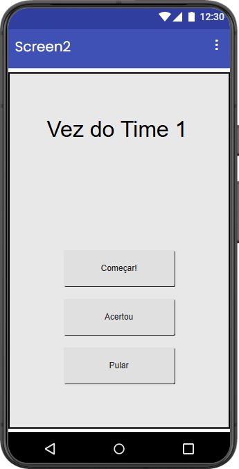

Esta pasta contém arquivos do jogo de mímica **"Cinema Mudo"**, feito com o [MIT App Inventor](https://appinventor.mit.edu/) para minha Atividade Extensionista.

Eis a descrição de cada arquivo:

* `Cinema_Mudo.aia`: backup completo do jogo (pode ser importado no App Inventor).
* `acertou.mp3`: áudio do botão "Acertou" (fonte: [Pixabay](https://pixabay.com/sound-effects/film-special-effects-goodresult-82807/)).
* `pular.mp3`: áudio do botão "Pulou" (fonte: [Pixabay](https://pixabay.com/sound-effects/film-special-effects-sad-trumpet-278822/)).
* `timer.mp3`: áudio reproduzido quando acaba o tempo (fonte: [Pixabay](https://pixabay.com/sound-effects/film-special-effects-buzzer-or-wrong-answer-20582/)).
* `filmes.txt`: lista que compilei com 107 títulos de filmes.
* `Material_aula_02.pdf`: material impresso e distribuído aos alunos no início da aula.
* `Montagem_do_app.pdf`: imagens dos botões que compõe a maior parte do aplicativo.

Design e código do jogo: Ricardo Mendonça Ferreira.

Captura de tela:

