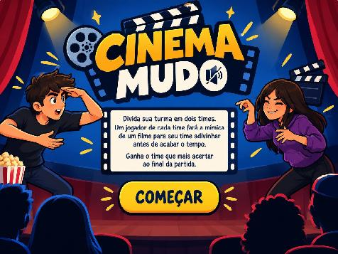
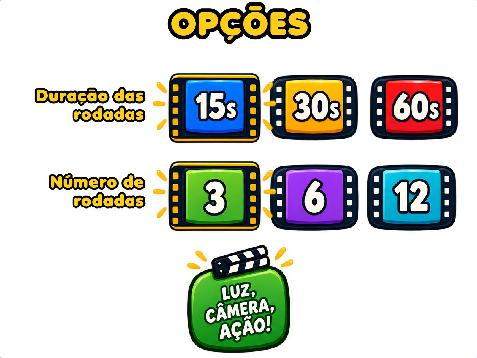
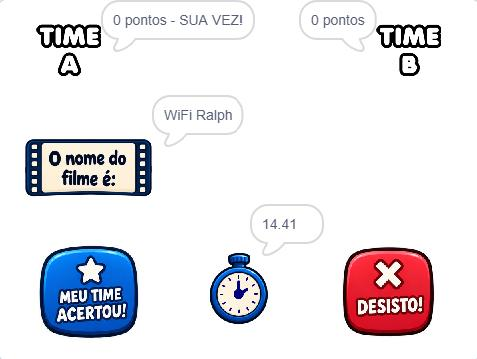
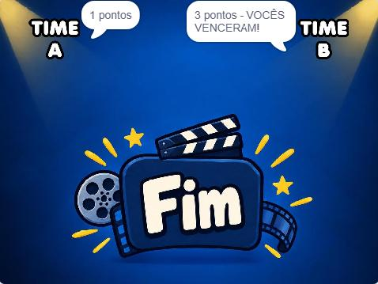

Esta pasta contém arquivos do jogo de mímica **"Cinema Mudo"**, criado com [Scratch](https://scratch.mit.edu/) para minha Atividade Extensionista.

Neste jogo, os participantes se dividem em 2 grupos. A cada rodada, um integrante de cada grupo deve, na sua vez, fazer a mímica do filme sorteado pelo app para que sua equipe adivinhe antes que acabe o tempo da rodada. Vence o time que acertar o maior número de filmes.

Principais arquivos:
* `.png` e `.jpg`: os assets do jogo (criados por mim e via ChatGPT).
* `acertou.mp3`: áudio do botão "Acertou" (fonte: [Pixabay](https://pixabay.com/sound-effects/film-special-effects-goodresult-82807/)).
* `pular.mp3`: áudio do botão "Pulou" (fonte: [Pixabay](https://pixabay.com/sound-effects/film-special-effects-sad-trumpet-278822/)).
* `timer.mp3`: áudio reproduzido quando acaba o tempo (fonte: [Pixabay](https://pixabay.com/sound-effects/film-special-effects-buzzer-or-wrong-answer-20582/)).
* `filmes.txt`: lista que compilei com 107 títulos de filmes.
* `Material_aula_03.pdf`: material impresso e distribuído aos alunos no início da aula.
* ([Link](https://scratch.mit.edu/projects/1379967642/)) `Cinema Mudo (completo).sb3`: backup do jogo completo (pode ser importado no Scratch). Usado apenas para apresentar aos alunos o funcionamento da versão final do jogo.
* ([Link](https://scratch.mit.edu/projects/1381138320/)) `Cinema Mudo (incompleto).sb3`: backup do jogo incompleto, usado pelos alunos na atividade pedagógica (pode ser importado no Scratch).

Use os dois links acima para ver e editar o respectivo projeto no Scratch (requer conexão com a Internet).

Design e código do jogo: Ricardo Mendonça Ferreira.

Capturas de tela:
---

---

---

---

